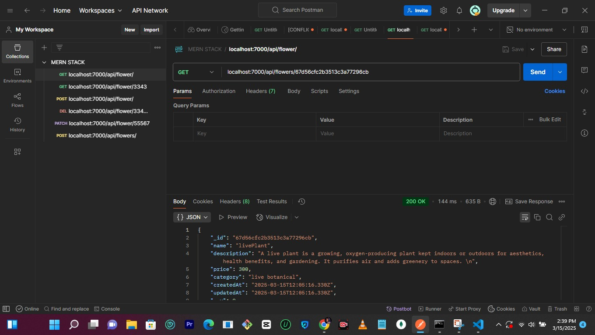

# MERN-STACK

## Table of Contents

- [Project Name](#project-name)

  - [Table of Contents](#table-of-contents)

  - [Introduction](#introduction)

  - [Live Demo](#live-demo)

  - [Features](#features)

  - [Technologies Used](#technologies-used)

  - [Setup and Installation](#setup-and-installation)

  - [Usage](#usage)

  - [Screenshots](#screenshots)

  - [License](#license)

  - [Author(s)](#authors)

## Introduction

This project is mainly focused on the backend of a flowery-delivery website.


## Live Demo

[Live Demo Link](https://gimbalgal.github.io/MERN-STACK/)

[Loom link](https://www.loom.com/share/1f1aa5f752734d95a67af943a87129a9?sid=6a74d107-b7af-4c4e-b4a7-2bd688dadd64)


## Features

[http://localhost:7000/flowers](http://localhost:7000/api/flowers/67d56cfc2b3513c3a77296cb)

- GET /API/flowers

- GET /API/flowers/:id
- POST /API/flowers
- PATCH /API/flowers/:id
- DELETE /API/flowers/:id


## Technologies Used

- Express

- node.js

- React

- MongoDB


## Setup and Installation

Explain how to set up and run your project locally. Include prerequisites, installation steps, and any necessary configurations.


 1/. **Create and folder:**

    ```sh
      cd to the folder


2\. **Navigate to the project directory:**

    ```sh

    cd your-repo-name

    ```

3\. **Install dependencies:**

    ```sh

    npm install

    ```


4\. **Run the project:**

    ```sh

    npm start

    ```

## Usage

This project mainly deals with the backend point. this focuses on the flowerController, the Models, and middlewares.


## Screenshots

Include screenshots or GIFs of your project in action. This helps users understand what your project looks like and how it functions.




## License

Include information about the license under which your project is distributed. For example:

This project is licensed under the MIT License - see the [LICENSE](LICENSE) file for details.


## Author(s)


- **Name:** Victoria Augustine Ishabo

- **Email:** victoriaishabo55@gmail.com

- **GitHub:** [your-username](https://github.com/Gimbalgal/Gimbalgal)


